## Government guidance on 'critical' safety issues for walking and cycling

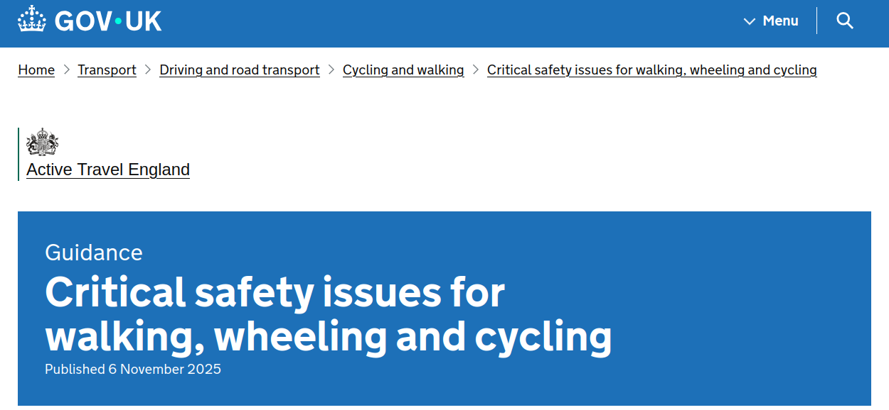

> "A critical safety issue is defined as a street layout or condition that is associated with an increased risk of collisions for people walking, wheeling or cycling."

## Interactive part: what are critical issues from your perspective?

More broadly: what makes you feel unsafe in relation to road danger when walking, wheeling or cycling?

## Critical issues in context

### 3 broad categories of road danger

- **Infrastructure** — The focus of this presentation
- **Interactions**
- **Activities**

### Questionnaire questions

- Which aspects of transport infrastructure make you feel unsafe in relation to road danger, and how?
- Which interactions with other road users make you feel unsafe in relation to road danger?
- What types of surrounding activities make you feel unsafe in relation to road danger, and how?

## Input datasets

::::: columns
::: {.column width="60%"}

- **OpenRoads, OSM, OSMRN** — Best of all worlds network data
- **STATS19** — Collision data
- **Counters + model** — AADT estimates
- **OSM** — Crossing type, footway width
- **MMTopo** — Pavement geometry
- **Modelling framework**: Bayesian regression (brms) $Y \sim f(X)$ — will give confidence intervals in results

:::
::: {.column width="40%"}

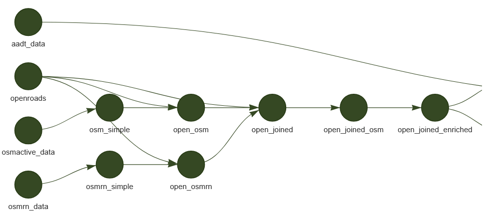

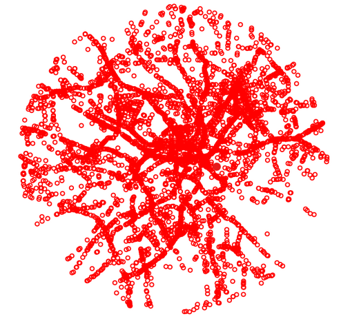

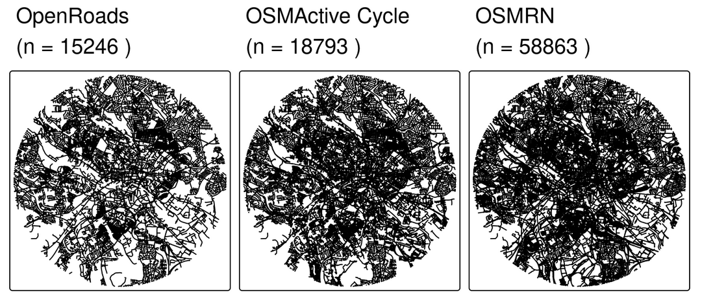

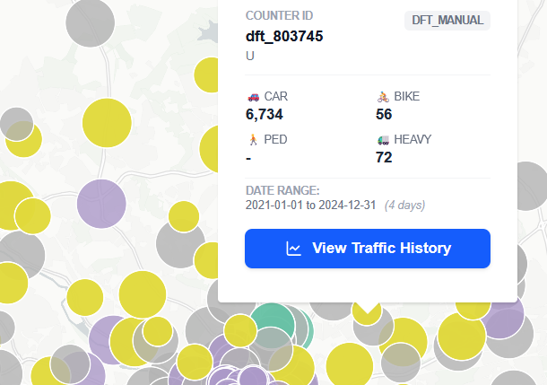

:::
:::::

## Variables and units of analysis

| Datasets | Variables | Critical issues |
|---|---|---|
| OpenRoads | Road name | All |
| OSMRN | Road width | SA03 |
|  | Motor traffic speed | SA08 |
| Counters + model | AADT | SA01, SA02, SA09 |
| OSM | Crossing type | SA06, SA07 |
| MMTopo | Footway width | SA11 |

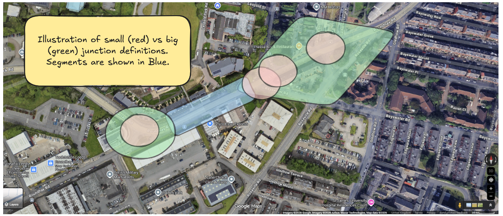

Source: RL (Excalidraw)

## Assumptions and scope

::::: columns
::: {.column width="50%"}

- Bigger (green) or smaller (red) representations of junction systems (big to start)? — We went green
- Should we calculate corner radii for junctions (not in first instance)? — Only if time allows
- How to handle refuge islands (ignore in first instance)?
- Do we include cycleway widths, surface, level of service (no)?

:::
::: {.column width="50%"}

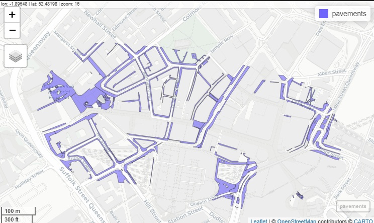

:::
:::::

## Sample of pavement geometry data

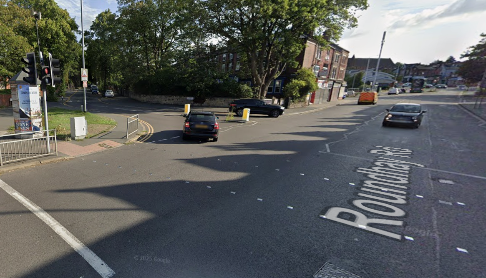

Source: Ordnance Survey. Action: obtain national pavement dataset.

## Proposed approach: statistical framework and envisaged outputs

::::: columns
::: {.column width="50%"}

- For each variable we will model impact on collisions/ksi
- What is acceptable risk?
- Thresholds for junctions vs segments?
- N. variables vs statistical power
- [Result]{.alert}: unified framework for comparing multiple characteristics associated with Critical Issues and their interrelations

:::
::: {.column width="50%"}

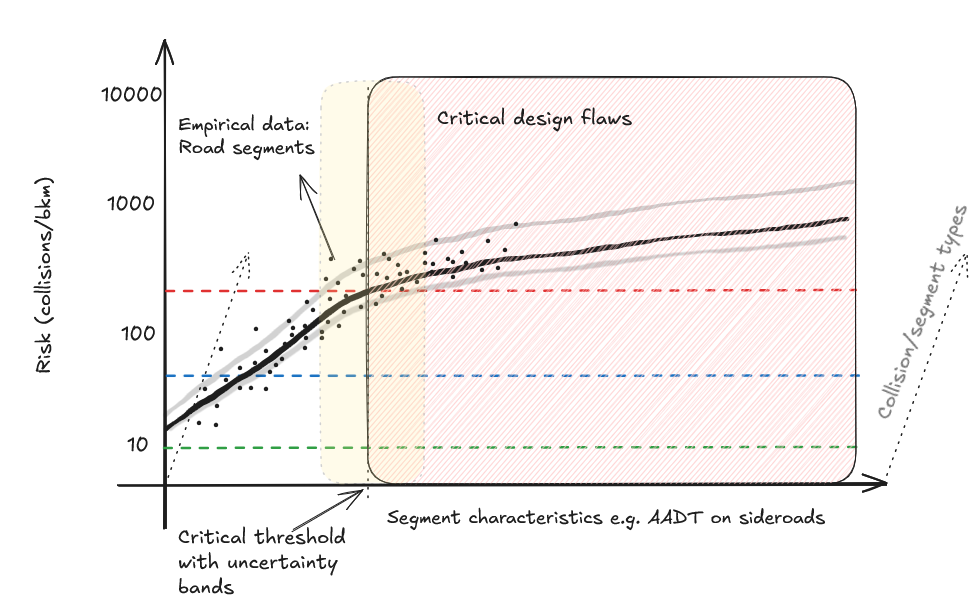

Source: University of Leeds

:::
:::::

## Approach: Modularity

::::: columns
::: {.column width="55%"}

Most research builds on more-or-less shaky foundations.

We're aiming to build [strong foundations]{.alert}.

That means publishing data outputs and open tools (R/Python packages) where possible [@lovelace2021].

Example: [github.com/itsleeds/vivacitypy](https://github.com/itsleeds/vivacitypy)

:::
::: {.column width="45%"}

:::
:::::

## Counter locations

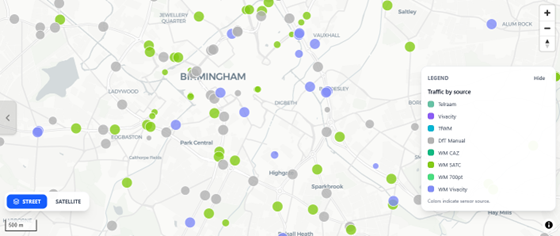

## Cycling estimates

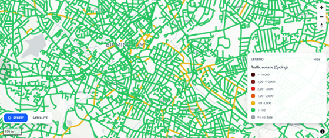

## Walking estimates

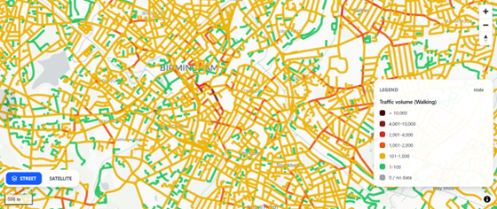

## Next steps

- Improve classification of critical issues with reference to local knowledge
- Improve pedestrian traffic estimates
- Statistical modelling, building on open tools for geographic analysis [@lovelace2021] and urban network analysis methods [@sevtsukMadinaPythonPackage2025a]

## References {scrollable="true"}

::: {#refs}
:::